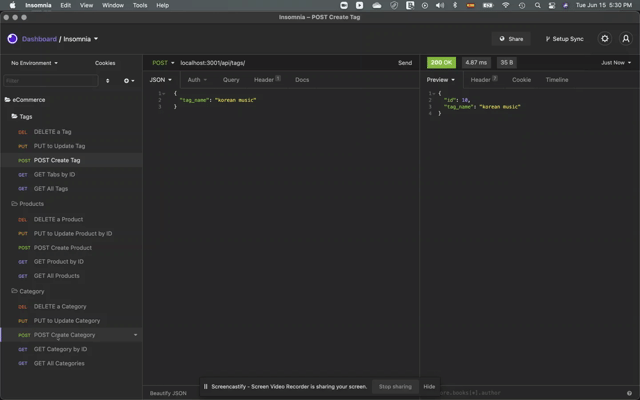

# eCommerce-back-end
Back end for e-commerce site modifying starter code (homework)

## Description

```md
A manager at an internet retail company can use the latest technologies for their competitive advantage in the market.
```
The back end development for the e-commerce site was performed by modifying starter code, using Express.js and configuring to include Sequilize to connect the APU to the mySQL database.

## Acceptance Criteria
```md
The user:
* Adds the database name, mySQL username, and mySQL password to an environment variable file
* Is able to connect to a database using Sequelize, when entering schema and seed commands:
    - A database is created and is seeded with test data
* Enters the command to invoke the application:
    - The server starts, and Sequelize models synch to mySQL database
* Opens the API GET routes in Insomnia Core for:
    - Categories
    - Products or
    - Tags
    the data for each route is displayed in JSON format

* Tests API: GET, POST, PUT, and DELETE routes in Insomnia Core, the user can successfully create, update, and delete data in the database 
```

## Mock-up

The attached animations depict the application's:
a) GET routes to return all categories, all products, and all tags being tested in Insomnia Core:


b) GET routes to return a single category, a single product, and a single tag being tested in Insomnia Core:


c) POST of a single category, a single product, and a single tag being tested in Insomnia Core:



d) PUT of a single category, a single product, and a single tag being tested in Insomnia Core:


e) DEL to delete a single category, a single product, and a single tag being tested in Insomnia Core:


## LINKS 

### Link to gitHub
[GitHub Repo](https://github.com/adina-hc/eCommerce-back-end)

### Link to video
[Link to video](https://drive.google.com/file/d/1dgjfemwWuMke7ly7ktjw1hH80RzMHlUs/view)
